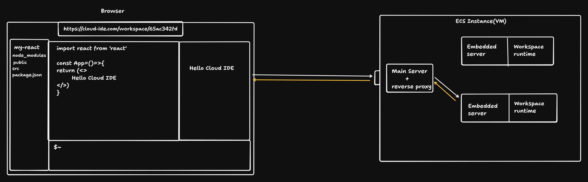

# Cloud IDE – Next-Gen Collaborative Development Platform

## Overview

Cloud IDE is a modern, browser-based integrated development environment designed for seamless cloud coding. It enables users to code, preview, and manage full-stack applications from anywhere—no local setup required. Built with a focus on real-time collaboration, scalability, and a smooth developer experience, Cloud IDE blends productivity with cloud-native technologies.

## Key Features

- **Online Code Editing:** Intuitive, VSCode-like editor supporting multiple languages and projects.
- **Live Preview:** Instantly preview web applications with dynamic routing—just like running locally.
- **Terminal Access:** Secure, browser-based terminal for powerful CLI operations and scripting.
- **File Explorer & CRUD APIs:** Interactively browse, create, edit, and delete project files and folders.
- **Real-time Updates:** Changes made in code or file structure reflect instantly via WebSockets.
- **Workspace Isolation:** Each workspace runs in its dedicated runtime, sandboxed for security and stability.
- **Containerized Infrastructure:** Workspace runtimes launched via fast, ephemeral containers (Docker/ECS), scaling effortlessly on demand.
- **Reverse Proxy Routing:** Main server intelligently proxies requests, directing traffic to appropriate workspaces without exposing all ports.

## Architecture

The architecture follows a robust, service-oriented flow:

- **Browser/Frontend:**  
  - Renders the code editor, file explorer, live preview, and terminal.  
  - Communicates directly with the main server for file operations, code execution, and updates.
- **Main Server (Reverse Proxy):**  
  - Authenticates users, orchestrates workspaces, and routes client requests to the right embedded server.
  - Handles reverse proxying—ensuring preview and API requests reach the correct workspace container.
- **ECS Instance (VMs):**  
  - Hosts workspace containers, each running an embedded server and isolated runtime.
  - Embedded servers watch filesystem events, send real-time updates, and expose REST/WebSocket endpoints per workspace.

See the architecture diagram above for a visual overview.

## Typical Workflow

1. **User navigates to workspace:**  
   Browser connects to `https://cloud-ide.com/workspace/<workspaceId>`.
2. **Main server authenticates and routes:**  
   Main server spins up (or reuses) a containerized workspace, routing traffic accordingly.
3. **Real-time development:**  
   User edits code, runs commands, manages files—all operations propagate instantly through the system.

## Technologies Used

- **Frontend:** React (with Vite), custom real-time editors.
- **Backend:** Node.js (Express/Koa), REST APIs, WebSocket for streams.
- **Containers/Cloud:** Docker, AWS ECS (or similar), Reverse proxy (nginx/Express-based).
- **Persistence:** Workspace data either on ephemeral VM storage or cloud mounts (future roadmap).
- **Others:**  
  - Advanced system design for orchestration and fault tolerance.  
  - Scalable with horizontal container deployment.

## Why Cloud IDE?

- Onboard new developers in seconds—no setup, just code.
- Build, preview, and deploy from any device.
- Ideal for workshops, hackathons, and distributed teams.
- Extensible design—easy to add new language runtimes, tools, and collaborative features.

## Getting Started

> _**Note:** Setup, deployment, and contribution instructions will be provided in future releases. Stay tuned!_
