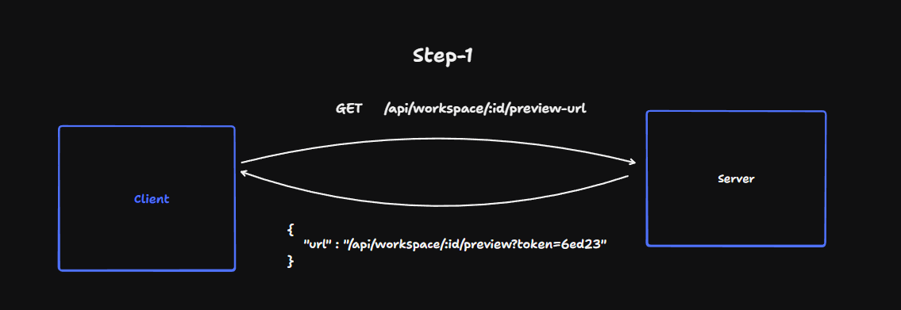
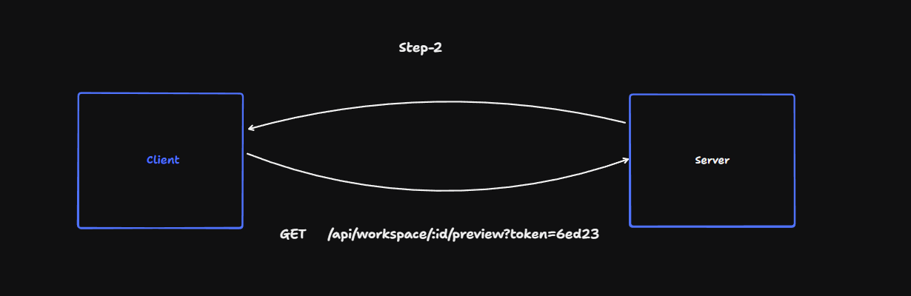
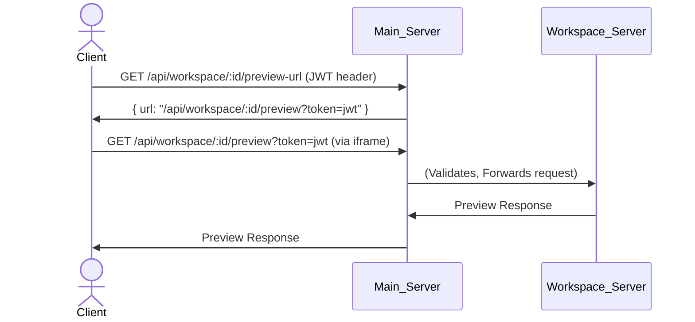

# Cloud IDE: Secure Preview Flow

Previewing user workspaces in a cloud-based IDE requires carefully balancing security and usability. This document explains our solution for securely embedding workspace previews via iframe, using a short-lived JWT-authenticated URL.

## What Problem Did We Solve?

Initially, we wanted to expose a simple REST endpoint like:

```
GET /api/workspace/:workspaceId/preview
```

so the client (React) app could request a workspace preview. However, iframes do not support sending custom JWT tokens in requests—their src URLs make unauthenticated network requests by default, creating a security risk for sensitive previews.

**Challenge:**
How to securely serve workspace previews when the request is made by an iframe (with no authentication headers)?

---

## Our Solution: Authenticated, Short-Lived Preview URLs

### Approach Recap

1. Client requests a signed preview URL from the main server, using their JWT token for authentication (via header).
2. Main server generates a short-lived JWT token bound to the workspace and user, then sends back a preview URL containing this token as a query parameter.
3. The iframe uses this signed URL as its src, making an unauthenticated request.
4. On request, the main server validates the token, checks workspace/user match, then proxies the preview from the actual workspace process.

---

## Step-by-Step Flow

### Step 1: Fetch Signed Preview URL

#### Sequence

- Client sends:
 ```
 GET /api/workspace/:id/preview-url
 ```
 (With JWT token via the header)

- Main Server checks JWT, gets user info, generates a new short-lived JWT with workspace ID and user ID in payload, then responds:

 ```json
 { "url": "/api/workspace/:id/preview?token=<jwt>" }
 ```

#### Illustration



#### Sequence

- Client sets iframe:
 ```jsx
 <iframe src="/api/workspace/:id/preview?token=<jwt>" />
 ```

- Iframe issues GET request to new URL (with token as query).

- Main Server:
 - Validates token.
 - Checks workspace ID and user match.
 - If valid, forwards request to workspace preview server (reverse proxy).
 - Returns the preview content to the iframe.

#### Illustration



- Security:
 Only authenticated users can fetch signed preview URLs. The token's expiry prevents re-use.

- Usability:
 Works seamlessly with iframes, which cannot send authenticated headers.

- Isolation:
 Each preview URL is workspace- and user-specific, reducing leakage risk.

- Reverse Proxying:
 The main server mediates access, ensuring only valid, active requests reach workspace preview servers.

---

## Implementation Summary

- GET /api/workspace/:id/preview-url
 - Requires JWT header for user authentication.
 - Responds with a signed, short-lived preview URL.

- GET /api/workspace/:id/preview?token=<jwt>
 - Main server validates the token.
 - Ensures workspace/user match.
 - Proxies to actual preview service.

---

## Diagram: Flow Overview



---

## Key Points

- Short-lived URLs ensure expired tokens cannot be re-used.
- All logic for preview access is centralized in the main server.
- Reverse-proxying abstracts workspaces behind main server, improving observability and security.

---

## References

- Implementation details: add specifics as needed
- Images:
 - Fetch-Preview-URL.jpg
 - Preview.jpg
